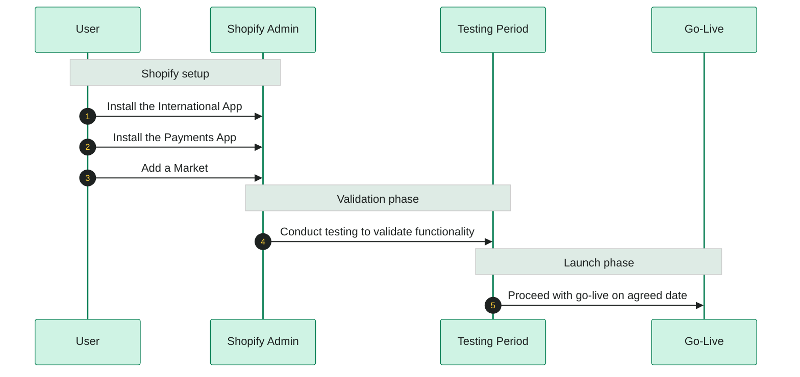

# Quick Start Guide

Welcome to ESW!&#x20;

Expand your Shopify store globally with ESW. From multi-currency payments to duties, taxes, and international shipping, ESW simplifies global commerce so you can sell anywhere - all while staying compliant, all from one platform.&#x20;

Important note: to use the ESW Shopify integration, you must download and enable both International and Payment Apps. They are designed to work together and cannot be used separately.&#x20;

Once you have downloaded these two apps, please contact the ESW Onboarding team. They will complete the provisioning for your account, so the apps can be activated and ready to use.

Let’s get started.&#x20;



#### Before you Begin

* The integration of the ESW Shopify Apps requires that you install, enable, and configure *both*, the International App and the Payments App for the solution to be functional.
* Note that these applications are interdependent.
* These Apps cannot be implemented or used separately.
  

### Managed Process

* After the apps are installed, your account must be provisioned by the ESW Onboarding Team.
* Contact our team and provide your shop domain to notify them of your installation. The onboarding team will complete the provisioning for you.
* Once provisioning is complete, the app will become available for activation in your Shopify admin.
* Activation is the final, simple step that enables ESW apps.

#### Order of Action




### Install the International App

Install the ESW Shopify [International App](/shopify/shopify-native/quick-start-guide/install-esw-shopify-apps.md#international-app-1).




### Install the Payments App

Install the ESW Shopify [Payments App](/shopify/shopify-native/quick-start-guide/install-esw-shopify-apps.md#payments-app-1).




### Create a Market

[Create and configure a m**a**rket](/shopify/shopify-native/configuration/create-a-new-market.md) for your target region(s).




### Add Legal Messaging

Add the [ESW Privacy Notice](/shopify/shopify-native/configuration/add-legal-messaging.md) to your Shopify checkout page.




### Testing Period


Conduct testing to validate:

* App integrations
* Payment workflows
* Market settings and configurations
  
  



### Go-Live

Once testing is successful, proceed with **go-live** on the agreed date.


Testing before go-live ensures smooth functionality and reduces potential issues in production.








***
